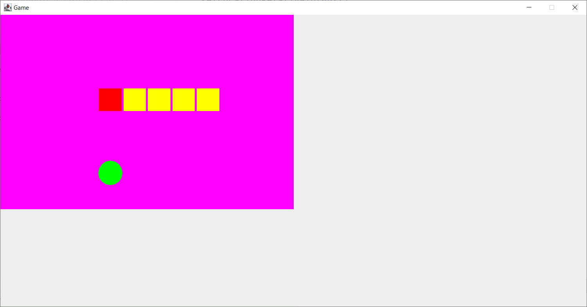

# Проект **Змейка**

Реализуйте в этом репозитории вашу змейку.
Придерживайтесь следующих общих рекомендаций
- Почаще приводите программу в рабочий (но, возможно, неполный) вид. Начните с 
того, что быстрее всего даст видимый результат. Например, начните с двигающейся по 
тикам головы змейки.
- Старайтесь давать переменным понятные имена. Проект довольно сложный,
код придется много раз перечитывать.
- Даже если у вас будет хотя бы какая-то змейка к концу нашего курса, это уже достижение,
ибо проект нетривиальный.
- Вначале добейтесь самой простой змейки - генерируется еда (возможно, в змейке),
змейка двигается, растет при поедании еды, врезается сама в себя.
- В последний день курса появятся задания на возможное расширение змейки на случай,
если вы успеете к тому моменту добиться какого-то результата.
- Pro-tip: рисуйте блоки змейки мельче, чем клетки, по которым она ходит.
